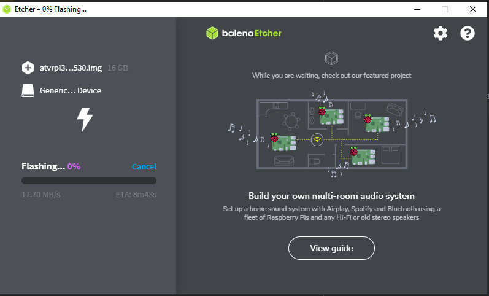

Title: Установка Android TV на Raspberry PI3 b+
Date: 2020-11-15 10:00
Author: ifilatov
Tags: rpi, howto, androidtv, google
Status: published
image: etcher.png
Summary: Сказ о том, как я устанавливал Android TV на свою малинку

## Ссылки

- [Android TV image](https://deac-riga.dl.sourceforge.net/project/android-rpi3/atvrpi320160530.zip)
- [Etcher](https://www.balena.io/etcher/)

## Инструкция

1. Записываем [образ](https://deac-riga.dl.sourceforge.net/project/android-rpi3/atvrpi320160530.zip) через [Etcher](https://www.balena.io/etcher/)
2. Вставляем флешку в RPI3 и запускаем
