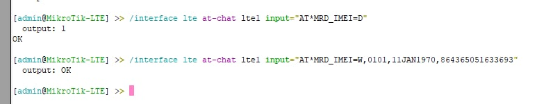

## Удаляем IMEI
`/interface lte at-chat lte1 input="AT*MRD_IMEI=D"`

## Записываем новый
`/interface lte at-chat lte1 input="AT*MRD_IMEI=W,0,01JAN1970,3529061130xxxxx"`

## Перезапускаем модем
`/interface lte at-chat lte1 input="AT+reset"`