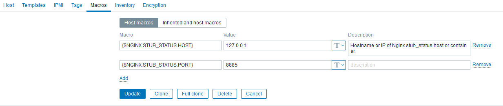

title: Мониторим NGINX

# Мониторим NGINX

[Zabbix 5](https://www.zabbix.com/ru) имеет на борту шаблон: `Template App Nginx by Zabbix agent`.

Чтобы он заработал, нужно правильно настроить `nginx` и прописать переменные в `zabbix` согластно скрину:

[](img/zabbix.png)

и прописать конфиг в `nginx`

??? summary "`/etc/nginx/site_enabled/nginx_server_status.conf`"

    ```nginx
    server {
      listen 127.0.0.1:8885;
      server_name monitor;
    
      server_name_in_redirect off;
      access_log off;
    
      location  / {
        stub_status on;
        allow 127.0.0.1;
        deny all;
      }
    }
    ```